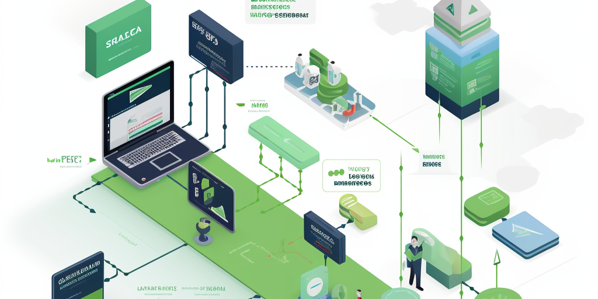

# generator-trailblazer

[](https://beerpay.io/jamrizzi/generator-trailblazer)
[](https://beerpay.io/jamrizzi/generator-trailblazer?focus=wish)
[](https://github.com/jamrizzi/generator-trailblazer)

A pragmatic implementation of TrailsJS for rapid development



Please &#9733; this repo if you found it useful &#9733; &#9733; &#9733;


## Features

* Automatic restart during development
* Custom responses types
* Boom error handling
* Express for the server
* Waterline for the ORM
* Mongo for the database
* Super efficient docker support


## Installation

```sh
sudo npm install -g yo generator-trailblazer
```


## Dependencies

* [NodeJS](https://nodejs.org)
* [Yeoman](http://yeoman.io)


## Usage

[Contribute](https://github.com/jamrizzi/generator-trailblazer/blob/master/CONTRIBUTING.md) usage docs


## Support

Submit an [issue](https://github.com/jamrizzi/generator-trailblazer/issues/new)


## Screenshots

[Contribute](https://github.com/jamrizzi/generator-trailblazer/blob/master/CONTRIBUTING.md) a screenshot


## Contributing

Review the [guidelines for contributing](https://github.com/jamrizzi/generator-trailblazer/blob/master/CONTRIBUTING.md)


## License

[MIT License](https://github.com/jamrizzi/generator-trailblazer/blob/master/LICENSE)

[Jam Risser](https://jam.jamrizzi.com) &copy; 2018


## Changelog

Review the [changelog](https://github.com/jamrizzi/generator-trailblazer/blob/master/CHANGELOG.md)


## Credits

* [Jam Risser](https://jam.jamrizzi.com) - Author


## Support on Beerpay (actually, I drink coffee)

A ridiculous amount of coffee :coffee: :coffee: :coffee: was consumed in the process of building this project.

[Add some fuel](https://beerpay.io/jamrizzi/generator-trailblazer) if you'd like to keep me going!

[](https://beerpay.io/jamrizzi/generator-trailblazer)
[](https://beerpay.io/jamrizzi/generator-trailblazer?focus=wish)
